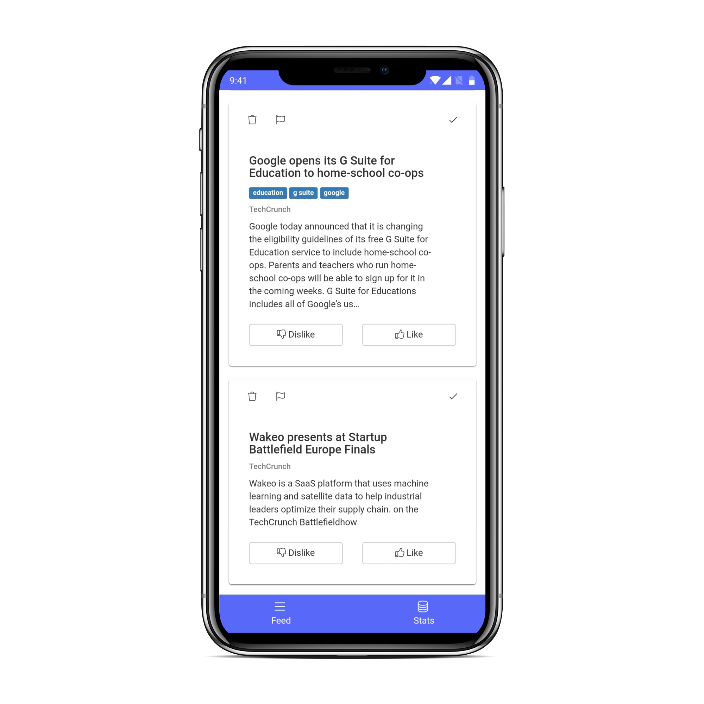

<p align='center'></p>
<h1 align="center">Gazette</h1>
<p align="center">A personal news aggregator</p>
<br />
<br />

## About

Gazette is a simple Meteor application that aggregates news and generates a database of articles you read as well as your opinion about them. The primary goal of Gazette is to build a database of articles you are interested in. In the future, this could be used with ML to recommend articles, or even only show articles that are relevant to your preferences.



## Setup

1. **Install Meteor**

    On Linux & Mac:

    ```sh
    > curl https://install.meteor.com/ | sh
    ```

    This will setup [Meteor](http://github.com/meteor/meteor) (including [Node](https://github.com/nodejs/node) and [Mongo](https://github.com/mongodb/mongo) if necessary).

    > _Note:_ Windows users must [download installer](https://www.meteor.com/install).

2. **Clone Repository**

    ```sh
    > git clone https://github.com/juangesino/gazette.git
    > cd gazette
    ```

3. **Install Dependencies**

    If you have npm installed:

    ```sh
    > npm install
    ```

    If you only have meteor:

    ```sh
    > meteor npm install
    ```

4. **Run**

    While in repository directory run:

    ```sh
    > meteor run
    ```

    Load browser and go to [http://localhost:3000/](http://localhost:3000/)

    Alternatively, you can run:

    ```sh
    > meteor run android-device
    ```

    With an Android phone connected to your computer and with USB debugging enabled to run the server on your computer and install the APK on your phone (connected to the same network). More info about running Meteor on Android <a href="https://guide.meteor.com/mobile.html#running-on-android" target="_blank">here</a> and more info on debugging <a href="https://guide.meteor.com/mobile.html#remote-debugging-android" target="_blank">here</a>.

## Deploy

### Server

The Meteor application requires a server. We can do this by deploying the server to Heroku for free.

Follow <a href="https://medium.com/@leonardykris/how-to-run-a-meteor-js-application-on-heroku-in-10-steps-7aceb12de234#.lmg8s462o" target="_blank">these</a> steps to deploy the Meteor app on Heroku.

##### Setup Tasks

To perform scheduled tasks, we can use the <a href="https://elements.heroku.com/addons/scheduler" target="_blank">Heroku Scheduler</a>. It's free and easy to use.

The first task we need to setup is the cleaner. This task makes sure to clean up if articles start piling up.

Use the following command: `wget https://<HEROKU-APP-NAME>.herokuapp.com/tasks/clean` and set it to run daily.

Now we can setup the crawling tasks. At the moment, we have 3 available crawler tasks we can use:

**TechCrunch** ([techcrunch.com](https://techcrunch.com/))

```
wget https://<HEROKU-APP-NAME>.herokuapp.com/crawlers/techcrunch
```

**TodoNoticias** ([tn.com.ar](https://tn.com.ar/))

```
wget https://<HEROKU-APP-NAME>.herokuapp.com/crawlers/todoNoticias
```

**DutchNews.nl** ([dutchnews.nl](https://www.dutchnews.nl/))

```
wget https://<HEROKU-APP-NAME>.herokuapp.com/crawlers/dutchNews
```

<br>

You can set them to run as many times and as frequently as you need. If you are not using Heroku, you can use a Cron to perform each of these tasks.

**Note**: You will need to deploy this server for the Android app to work.

### Android

To build for Android run:

```sh
> meteor build ../<PATH-TO-BUILD>/gazette --debug --server=https://<YOUR-HEROKU-APP-NAME>.herokuapp.com/
```

Replace `<PATH-TO-BUILD>` with the actual path where you want your build to be generated.
Replace `<YOUR-HEROKU-APP-NAME>` with the name of the Heroku app for your server. If you are not using Heroku, replace the entire `--server` argument with your server's URL.

## Contributing

1. Fork it ( https://github.com/juangesino/gazette/fork )
2. Create your feature branch (`git checkout -b my-new-feature`)
3. Commit your changes (`git commit -am 'Add some feature'`)
4. Push to the branch (`git push origin my-new-feature`)
5. Create a new Pull Request

## License

See [MIT-LICENSE](https://github.com/juangesino/photon/blob/master/LICENSE).
